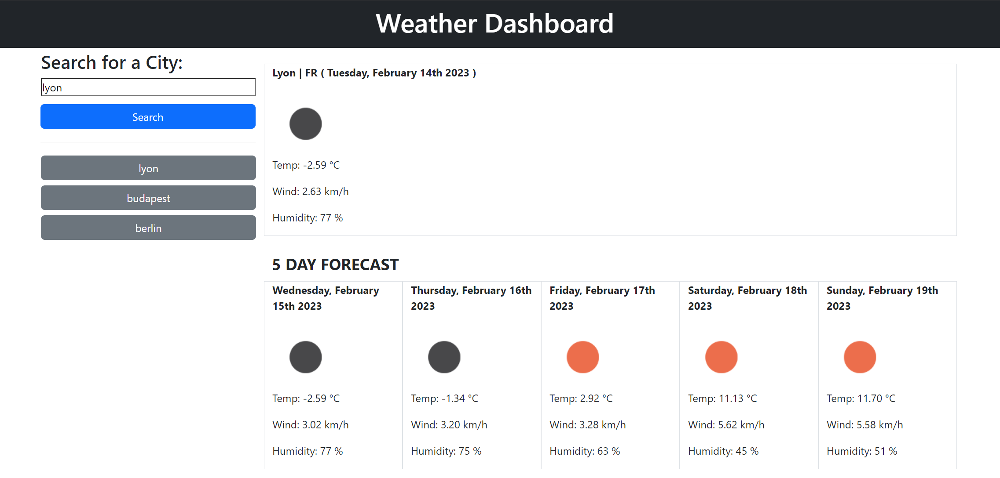

# Weather Dashboard 

## Moch-up

The following image shows the web application's appearance and functionality:

&nbsp;

#### ** Demo **

&nbsp;

## Description

* This app is fetching weather forecast through Open Weather API (https://openweathermap.org/) by user search or by clicking any history buttons dinamicly created.

&nbsp;

## Features
* It presents todays weather and 5 day forecast, displaying dinamic date, temperature, wind speed and humidity and a custom icon based on weather conditions.
* Web application has been created using HTML, CSS, JS. It utilezes jQuery and Bootstrap frameworks but also takes advantage of Moment JS features.

&nbsp;

## Prerequisites 

To install this application, you will need a text editor. Visual Studio Code is recommended.

&nbsp;

## To Execute file

Open in local browser

&nbsp;
&nbsp;

## Website URL

https://georgeboholteanu.github.io/weather-dashboard/

&nbsp;

## Github Repo

https://github.com/georgeboholteanu/weather-dashboard

&nbsp;
&nbsp;

### Contact

For any suggestions or ideas ping me at [George Boholteanu](mailto:george.boholteanu@gmail.com)

© 2023 George Boholteanu. All Rights Reserved.